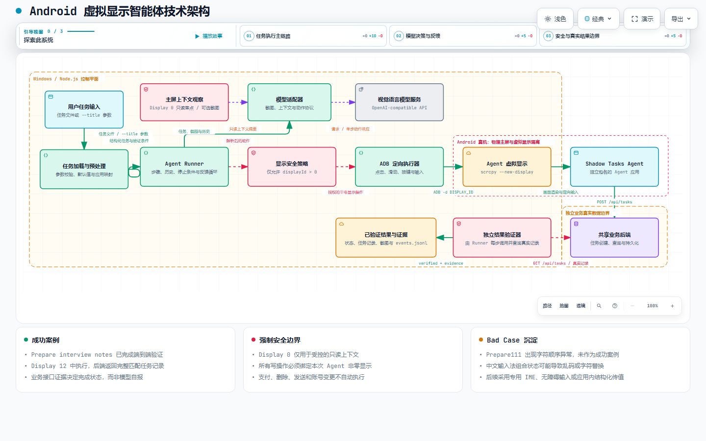

# Android虚拟显示智能体系统设计与实现报告

## 摘要

本项目实现了一个运行在 Android 真机上的虚拟显示智能体原型。用户继续使用手机物理主屏，Agent 在同一台手机的独立虚拟显示中完成应用启动、页面识别、点击、滑动和文字输入等操作。

系统通过 Android 调试桥工具 ADB 与手机通信，使用基于 ADB 的开源 Android 屏幕控制与虚拟显示工具 scrcpy 创建 Agent 专用显示空间，并接入视觉语言模型分析虚拟显示截图。为避免 Agent 干扰用户，所有写操作均经过显示安全策略检查，只有目标显示编号大于零时才能执行。任务完成后，系统通过独立业务接口核验真实结果，而不是直接采用模型给出的完成结论。

真机测试中，Agent 成功创建了标题为 `Prepare interview notes` 的任务，并获得后端任务编号和创建时间，证明虚拟显示创建、模型决策、定向输入和结果验证链路可以正常运行。

**关键词：** Android 虚拟显示、手机智能体、ADB、scrcpy、视觉语言模型、结果验证

## 1 项目背景与目标

传统手机智能体通常直接操作用户当前使用的手机界面。当 Agent 执行点击、滑动或文字输入时，物理主屏会被占用，用户难以继续操作手机，还可能发生输入焦点冲突和误触。

本项目采用虚拟显示隔离方案：物理主屏 Display 0 继续由用户使用，Agent 只在系统新建的非零虚拟显示中执行任务。

项目需要完成以下目标：

1. 在同一台 Android 手机上创建 Agent 专用显示空间。
2. 将目标应用启动到指定虚拟显示。
3. 保证点击、滑动、按键和文字输入不会进入用户主屏。
4. 使用视觉语言模型根据虚拟显示画面逐步执行任务。
5. 通过独立业务接口判断任务是否真实完成。
6. 保存执行截图、操作记录和验证证据。

## 2 需求分析

| 需求 | 具体要求 | 完成情况 |
|---|---|---|
| 显示隔离 | 用户继续使用 Display 0，Agent 只操作非零虚拟显示 | 已实现 |
| 真实操作 | Agent 能够启动应用并执行点击、滑动和文字输入 | 已实现 |
| 安全约束 | 写操作必须绑定本次 Agent 显示编号 | 已实现 |
| 上下文保护 | 主屏默认只读取前台焦点，不默认保存截图 | 已实现 |
| 结果验证 | 模型声明完成后仍需查询真实业务结果 | 已实现 |
| 运行证据 | 保存每一步截图、动作和验证记录 | 已实现 |
| 用户入口 | 普通用户通过自然语言界面提交任务 | 后续完善 |

## 3 解决思路

系统将任务意图获取和任务执行分为两个阶段。

第一阶段由用户明确提供任务内容。当前原型通过任务配置文件或启动参数接收目标应用、操作要求、任务标题、风险等级和验证条件。

第二阶段由 Agent 在虚拟显示中完成任务。系统创建虚拟显示并启动目标应用，Agent Runner 持续截取虚拟显示画面，将截图、任务要求和最近操作历史发送给视觉语言模型。模型每次返回一个操作，系统解析操作并交给显示安全策略检查。通过检查后，ADB 定向执行器将操作发送到指定非零显示。

应用产生真实业务数据后，独立验证器查询共享后端。只有查询到符合任务条件的业务记录时，系统才返回完成状态。

整体处理过程如下：

1. 接收用户明确提交的任务内容和验证条件。
2. 创建独立虚拟显示并确认显示编号大于零。
3. 在虚拟显示中启动 Agent 版本应用。
4. 循环执行截图、模型判断、安全检查和设备操作。
5. 通过独立后端验证真实业务结果。
6. 保存截图和事件日志，并在结束时释放虚拟显示。

## 4 技术架构

技术架构以任务执行主链路为中心，展示主屏只读观察、模型决策、强制安全检查、虚拟显示操作和独立结果验证之间的关系。

**图 1 Android 虚拟显示智能体技术架构**

交互式版本：[查看技术架构图](./shadow-display-agent-architecture.html)

Windows 端的 Node.js 控制平面负责读取任务、管理 Agent 循环、调用模型、执行安全检查和验证结果。Android 真机内部保留物理主屏与 Agent 虚拟显示两个显示空间。Shadow Tasks Agent 只运行在非零显示中，并通过共享业务后端写入任务数据。独立验证器随后查询真实记录，生成最终完成状态和验证证据。

### 4.1 架构主链路

1. 用户通过任务文件或启动参数提供明确任务输入。
2. 任务加载与预处理模块完成参数校验、默认值补充、应用映射、风险等级和验证条件整理，输出结构化任务。
3. 主屏上下文观察模块提供受控的前台信息，默认不采集主屏截图。
4. 模型适配器将虚拟显示截图、结构化任务和历史操作发送给视觉语言模型。
5. Agent Runner 解析模型返回的单步动作，并交给显示安全策略。
6. ADB 定向执行器将通过检查的操作发送到指定非零显示。
7. Agent 应用写入共享后端，独立验证器查询真实任务记录。
8. 验证成功后，系统输出完成状态、业务证据、截图和事件日志。

### 4.2 主要边界

架构中包含三个需要明确区分的边界：

- **Windows 和 Node.js 控制平面：** 负责任务调度、模型调用、安全检查、设备控制、验证和日志记录。
- **Android 真机显示边界：** Display 0 供用户使用，非零虚拟显示供 Agent 使用。
- **业务真实数据边界：** 共享后端保存真实任务记录，验证器以该记录作为最终验收依据。

### 4.3 关键技术决策与方案取舍

本项目的重点不只是让 Agent 能够操作手机，还要确保操作发生在正确的显示空间，并且可以用独立证据证明任务完成。因此，方案选择优先考虑隔离性、可验证性和原型实现成本。

| 决策点 | 采用方案 | 未采用方案 | 选择原因与代价 |
|---|---|---|---|
| Agent 操作空间 | Android 真机虚拟显示 | 直接操作物理主屏 | 虚拟显示可以让用户继续使用 Display 0，并将 Agent 写操作限制在非零显示；代价是部分厂商系统或应用对辅助显示支持有限 |
| 虚拟显示创建 | 基于 ADB 的开源 Android 屏幕控制与虚拟显示工具 scrcpy | 自行开发系统级 DisplayManager 服务 | scrcpy 无需修改 Android 系统即可快速创建和控制虚拟显示，适合原型验证；代价是需要管理外部进程，并受 scrcpy 和设备能力影响 |
| 设备控制 | ADB 指定显示输入 | 只使用全局坐标输入或模拟器 | 指定显示输入能够在代码层明确约束目标 Display ID，并直接在真机验证；代价是不同 Android 版本和厂商系统的命令支持存在差异 |
| 模型执行方式 | 视觉语言模型单步决策 | 固定坐标脚本或一次性生成完整计划 | 单步决策能够根据每一步的新画面调整操作，适应页面状态变化；代价是调用次数、延迟和重复动作风险更高，因此需要步数上限和重复动作纠正 |
| 完成判定 | 独立业务接口验证 | 仅根据页面变化或模型返回 `done` | 业务接口可以证明真实记录已经生成，避免把按钮点击成功误判为业务完成；代价是需要为不同任务开发对应验证器 |
| 同一应用双端演示 | 用户版与 Agent 版使用不同包名、共享后端 | 同一包名同时运行在两个显示 | 双包名可以避免任务栈和本地状态互相抢占，同时保留业务数据共享；代价是需要维护两个构建变体 |
| 控制平面 | Windows 端 Node.js 进程 | 将完整 Agent 内置到 Android 应用 | Node.js 便于整合模型接口、ADB、日志和测试，适合快速验证；代价是原型运行时依赖电脑和 USB 调试连接 |

其中最关键的取舍是“显示隔离”和“数据隔离”不能混为一谈。虚拟显示解决的是画面、焦点和输入目标隔离，但不会自动生成第二份应用数据。为避免同一应用的任务栈和本地状态冲突，演示工程另外采用双包名方案；两个应用只通过共享后端同步业务数据。

## 5 核心模块设计

### 5.1 任务输入模块

任务输入模块负责读取用户明确提供的任务内容。当前支持从 JSON 任务文件读取，也支持通过启动参数直接传入任务标题。

输入进入执行循环前会进行任务加载与预处理：读取并解析任务文件或启动参数，补充风险等级和执行参数的默认值，根据应用配置映射目标包名或启动页面，并整理独立验证器需要的验证类型和匹配条件。预处理结果是统一的结构化任务对象，供 Agent Runner、安全策略和验证器共同使用。

任务内容包括：

- 自然语言操作要求。
- 目标应用。
- 风险等级。
- 结果验证类型。
- 验证时需要匹配的任务标题。

当前主屏观察信息不直接作为完整任务指令。普通用户使用的自然语言输入框、语音入口和系统分享入口属于后续扩展内容。

### 5.2 主屏上下文观察模块

该模块以只读方式获取用户主屏当前前台应用。默认配置下不保存用户主屏截图。

只有同时满足以下条件时，系统才允许保存主屏画面：

1. 明确开启主屏截图功能。
2. 当前前台应用位于允许观察的包名白名单中。

主屏信息仅作为辅助上下文，Agent 的坐标和操作不能来源于主屏画面。

### 5.3 Agent Runner

Agent Runner 是任务执行的控制中心，负责：

- 管理当前步骤和最近操作历史。
- 截取 Agent 虚拟显示画面。
- 调用视觉语言模型。
- 解析模型返回的操作。
- 检测重复且无效的动作。
- 执行每一步后的结果验证。
- 控制最大执行步数和停止条件。

当模型连续输出相同动作时，Runner 会在操作历史中加入纠正信息，要求模型重新分析当前画面并选择不同操作。

### 5.4 视觉语言模型模块

模型适配器通过 OpenAI 兼容接口调用视觉语言模型。每次调用包含：

- 当前任务要求。
- 当前步骤编号。
- Agent 虚拟显示截图。
- 最近操作历史。
- 受控的主屏上下文摘要。

模型每次只能返回一个动作，包括点击、滑动、长按、输入、返回、主页、应用启动、等待或结束任务。

### 5.5 显示安全策略模块

安全策略在操作执行前检查目标显示编号。点击、滑动、长按、输入、返回、主页和应用启动等写操作只能发送到本次 Agent 虚拟显示。

如果目标显示编号为 Display 0，系统立即拒绝操作。支付、购买、删除、发送和账号变更等高风险操作也不在自动执行范围内。

### 5.6 ADB 定向执行器

Android 调试桥工具 ADB 负责电脑与手机之间的通信。项目通过 ADB 执行以下操作：

- 查询设备和显示信息。
- 在指定显示中启动应用。
- 截取指定显示画面。
- 向指定显示发送点击和滑动。
- 向指定显示发送按键和文字输入。

所有输入操作均携带目标显示编号。

### 5.7 虚拟显示管理模块

项目使用基于 ADB 的开源 Android 屏幕控制与虚拟显示工具 scrcpy 创建 Agent 专用显示空间。

scrcpy 启动后，Android 系统会分配一个新的非零显示编号。系统确认显示编号有效后，才会继续启动应用和执行操作。虚拟显示使用本地输入法策略，并关闭与主屏之间的剪贴板自动同步。

任务成功、失败或被中断后，系统关闭 scrcpy 进程并释放虚拟显示。

### 5.8 双实例应用

项目构建了两个不同包名的应用：

- Shadow Tasks 用户版本。
- Shadow Tasks Agent 版本。

两个应用使用不同任务栈和本地状态，但连接同一个业务后端。Agent 在虚拟显示创建的任务可以在用户版本中刷新查看。

### 5.9 共享业务后端

共享后端提供任务创建、任务查询、访问令牌检查和数据持久化功能。任务数据包括任务编号、标题和创建时间。

后端既为两个应用提供共享数据，也为独立验证器提供真实结果查询接口。

### 5.10 独立验证与日志模块

验证器不会直接采用模型给出的完成结论。系统会查询后端任务列表，检查是否存在与目标标题匹配的真实任务记录。

每次运行还会保存：

- 任务开始信息。
- Agent 虚拟显示编号。
- 每一步虚拟显示截图。
- 模型原始响应。
- 解析后的动作。
- 最终验证结果。
- 成功证据或失败原因。

## 6 实际实施步骤

### 第一步 完成开发环境配置

完成 Node.js、ADB、scrcpy、Android SDK 和 Gradle 环境配置，并通过 USB 连接 Android 真机。

### 第二步 完成设备能力检查

检查 ADB 连接、手机授权、显示发现、定向输入、虚拟显示、本地输入法策略和剪贴板隔离能力。

### 第三步 完成双实例应用构建

构建并安装用户版 Shadow Tasks 和 Agent 版 Shadow Tasks Agent，使用不同包名避免运行状态冲突。

### 第四步 完成共享后端部署

启动任务后端服务，并建立手机到电脑本地服务的访问通道。两个应用通过同一个后端读写任务数据。

### 第五步 完成任务和应用配置

配置应用包名、启动页面、任务指令、风险等级和验证规则。

### 第六步 完成视觉模型接入

配置视觉语言模型服务地址、访问参数、模型名称、最大步骤数和操作等待时间。

### 第七步 完成虚拟显示创建

通过 scrcpy 创建 Agent 虚拟显示，获取系统分配的非零显示编号，并将其登记为本次任务唯一允许写入的显示。

### 第八步 完成 Agent 执行循环

在虚拟显示中启动 Agent 应用，持续完成截图、模型分析、动作解析、安全检查、设备操作和结果验证。

### 第九步 完成运行证据保存

保存每一步截图、模型响应、解析动作和验证证据，便于复查任务过程。

### 第十步 完成资源清理

任务成功、失败或被人为中断时，关闭 scrcpy 进程并释放虚拟显示。

## 7 测试与验证

### 7.1 成功案例

本项目将 `Prepare interview notes` 作为唯一端到端成功案例。

任务要求为：

> 在 Shadow Tasks 中创建标题为 Prepare interview notes 的任务，并在任务出现在列表后结束。

本次执行过程如下：

1. 系统创建 Display 12 作为 Agent 虚拟显示。
2. Agent 在虚拟显示中启动 Shadow Tasks Agent。
3. Agent 点击任务标题输入区域。
4. Agent 输入 `Prepare interview notes`。
5. Agent 点击任务创建控件并等待业务写入。
6. 独立验证器查询后端任务列表并找到完整匹配记录。

验证结果如下：

| 验证项 | 结果 |
|---|---|
| 任务标题 | Prepare interview notes |
| 虚拟显示 | Display 12 |
| 任务编号 | 2dbaeb95-2cda-4e4c-95de-4819f53abf9d |
| 创建时间 | 2026 年 10 月 9 日 01 时 40 分 18 秒 北京时间 |
| 验证状态 | 通过 |

该案例证明系统已经打通任务输入、虚拟显示创建、应用启动、页面识别、文字输入、业务提交和独立验证的完整链路。

### 7.2 测试结果汇总

| 测试项目 | 结果 | 验证依据 |
|---|---|---|
| Android 真机连接 | 通过 | ADB 成功识别授权设备 |
| 虚拟显示创建 | 通过 | 获得多个非零 Display ID |
| Agent 应用启动 | 通过 | 应用在虚拟显示中正常运行 |
| 虚拟显示截图 | 通过 | 每一步均生成 Agent 截图 |
| 模型动作解析 | 通过 | 成功解析启动、点击和输入动作 |
| Display 0 写入保护 | 通过 | 安全策略拒绝主屏写操作 |
| 后端任务创建 | 通过 | 后端产生完整任务记录 |
| 独立结果验证 | 通过 | 查询到标题、任务编号和时间 |
| 执行证据保存 | 通过 | 保存截图和事件日志 |

## 8 遇到的困难、解决思路与 Bad Case

### 8.1 虚拟显示与主屏安全边界

第一个难点是“能够指定显示操作”不等于“系统始终会指定正确的显示”。如果某个调用遗漏 Display ID，输入仍可能进入用户主屏。

本项目没有依赖调用者自觉传参，而是在执行层前增加统一安全策略。每个写操作都必须携带目标显示编号，并同时满足“编号大于零”和“编号等于本次 Agent 显示”两个条件。这样即使模型输出错误动作或上层调用参数错误，Display 0 写入也会在真正执行前被拒绝。

### 8.2 同一应用在两个显示中的状态冲突

虚拟显示可以隔离窗口和输入，但不会自动创建新的应用数据目录。同一个包名在两个显示中运行时，仍可能共享进程、任务栈和本地状态，无法稳定表现为两个独立实例。

解决方案是构建用户版和 Agent 版两个不同包名。它们各自维护任务栈和本地界面状态，但连接同一个后端。这样既能稳定演示两个显示空间，又能让用户版看到 Agent 创建的真实业务数据。

### 8.3 完成状态可能被误判

仅依靠按钮点击、页面跳转或模型返回 `done`，无法证明业务操作真正成功。例如输入内容可能已经变形，但页面仍然完成提交。

项目将模型完成声明视为“可以开始验收”的信号，而不是最终结果。独立验证器随后查询后端，只有存在标题完全匹配的记录时才返回成功。该机制也直接发现了 `Prepare111` 和中文乱码问题。

### 8.4 模型重复动作

视觉模型可能因为页面反馈不明显而连续返回相同点击或滑动动作。如果不限制，执行循环会停滞并消耗模型调用次数。

Agent Runner 保存最近操作历史，识别连续重复动作，并把纠正信息加入下一轮模型上下文。同时设置最大步骤数，确保异常任务能够终止并留下失败证据。

### 8.5 Prepare111 字符顺序异常

在创建标题为 `Prepare111` 的任务时，后端没有出现完全匹配的目标记录，而是产生了 `111P` 和 `P111` 等字符不完整或顺序异常的结果。该测试不计入成功案例。

初步分析表明，问题发生在 ADB 文字注入和手机输入法的组合处理环节。部分厂商输入法会对注入字符进行联想、组合或重排。应用和后端可以正常运行，但最终保存的标题与任务要求不一致，因此独立验证器拒绝返回成功。

已沉淀的改进方向包括：

1. 输入前检查输入法状态。
2. 优先切换到英文直接输入模式。
3. 输入完成后复核输入框实际内容。
4. 校验失败时清空输入框并重新输入。
5. 使用专用输入法、无障碍文本设置或应用内结构化传值替代通用 ADB 文字注入。

### 8.6 中文输入乱码

部分测试中出现英文内容混入无关中文字符的现象。通用 ADB 文字输入主要适用于 ASCII 字符。当虚拟显示输入法处于中文组合状态时，英文字符可能被解释为拼音输入，导致候选词替换、字符缺失或顺序改变。

该问题的工程处理原则是把页面提交成功和业务数据正确分开判断。系统必须验证最终保存的标题，不能只依据按钮点击或页面变化确认完成。

后续测试还应分别覆盖：

- 纯英文输入。
- 纯数字输入。
- 中文输入。
- 中英文混合输入。
- 英文与数字混合输入。

### 8.7 Bad Case 汇总

| 案例 | 问题现象 | 初步原因 | 改进方向 |
|---|---|---|---|
| Prepare111 | 字符缺失或顺序变化 | ADB 输入与输入法组合处理 | 输入复核和专用输入通道 |
| 中文乱码 | 混入无关中文字符 | 中文输入法候选和组合状态 | 专用 IME、无障碍输入或结构化传值 |

## 9 AI 辅助编码的使用与审查

### 9.1 AI 的使用范围

项目开发过程中使用 AI 辅助完成需求拆解、备选方案分析、局部代码草拟、测试用例补充、错误日志分析和文档整理。AI 的角色是提高实现和排查效率，不负责替代需求判断、真机操作确认和最终验收。

以下内容由人工先确定为不可放宽的约束，再用于引导 AI：

- Display 0 只能读取受控上下文，不能接收 Agent 写操作。
- 所有写操作必须绑定本次创建的非零 Display ID。
- 高风险操作不自动执行。
- 模型返回完成不能代替独立业务验证。
- 失败案例必须如实保留，不能为了展示效果改写成成功。

### 9.2 引导 AI 的过程

1. **先拆分模块：** 将问题拆为虚拟显示管理、ADB 定向输入、模型动作协议、安全策略、验证器和日志，而不是要求 AI 一次生成完整系统。
2. **明确输入输出：** 为每个模块说明输入、输出、错误条件和安全边界，特别强调 Display ID 的传递规则。
3. **要求小范围修改：** 每次只处理一个明确问题，并检查修改是否影响其他模块。
4. **要求同时给出测试：** 对动作解析、Display ID 解析、安全拒绝和 Runner 停止条件补充自动化测试。
5. **用真实结果纠正方案：** 当真机出现 `Prepare111` 和中文乱码时，不接受“理论上可行”的回答，而是根据后端数据和运行日志继续定位。

### 9.3 人工审查方法

| 审查层面 | 审查内容 | 验收方式 |
|---|---|---|
| 需求一致性 | 是否真正实现主屏与 Agent 操作空间隔离 | 对照架构和任务目标逐项检查 |
| 安全性 | 是否存在未绑定 Display ID 的写操作；是否可能写入 Display 0 | 审查统一执行入口和安全策略测试 |
| 正确性 | 模型动作能否解析；异常响应是否被拒绝；循环能否正常停止 | 自动化测试与错误路径测试 |
| 可验证性 | 是否把模型声明误当作成功 | 检查独立 API 验证器及真实后端记录 |
| 隐私与配置 | 密钥、设备配置和运行数据是否进入版本库 | 检查忽略规则和提交内容 |
| 真机效果 | 虚拟显示、输入法和厂商系统行为是否符合预期 | Android 真机端到端测试 |

### 9.4 AI 生成内容的验收原则

AI 生成的代码只有在同时通过代码审查、自动化测试和对应场景验证后才会保留。对于涉及 Android 厂商差异和输入法状态的结论，以真机表现为准。无法通过完整业务验证的案例统一记录为 Bad Case，不以界面看似成功或模型自报成功代替验收。

## 10 最终结果与完成情况

项目已经实现 Android 物理主屏与 Agent 虚拟显示的操作隔离。用户可以继续使用物理主屏，Agent 在非零虚拟显示中启动应用、识别页面并执行任务。

当前已经完成：

- 物理主屏和 Agent 操作空间隔离。
- 虚拟显示中的应用启动和定向操作。
- 视觉模型驱动的单步执行循环。
- Display 0 写入保护和高风险动作限制。
- 用户版与 Agent 版应用的共享业务数据验证。
- `Prepare interview notes` 端到端成功案例。
- `Prepare111` 和中文乱码 Bad Case 沉淀。
- 执行截图、事件日志和验证证据保存。

## 11 局限性与后续改进

| 改进方向 | 当前情况 | 后续工作 |
|---|---|---|
| 任务提交入口 | 当前主要通过配置文件或启动参数提交任务 | 增加自然语言输入框、语音入口或系统分享入口 |
| 文字输入兼容性 | 部分输入法会组合或重排 ADB 注入字符 | 接入专用 IME、无障碍输入或应用内传值 |
| 设备兼容性 | 部分厂商系统可能限制辅助显示 | 增加设备能力探测和兼容性测试矩阵 |
| 应用数据隔离 | 虚拟显示不会自动创建第二份应用数据 | 使用双包名、应用分身或工作资料 |
| 验证范围 | 当前主要验证演示任务和文件结果 | 扩展数据库、API 和设备状态验证器 |

## 12 结论

本项目验证了 Android 虚拟显示用于手机智能体隔离执行的可行性。系统已经完成从显式任务输入到真实业务结果验证的完整原型链路，并通过 `Prepare interview notes` 案例证明主要模块能够协同工作。

现阶段的主要问题集中在不同输入法对 ADB 文字注入的兼容性。`Prepare111` 字符顺序异常和中文乱码已经作为 Bad Case 记录，并形成了输入状态检查、结果复核和专用输入通道等后续改进方向。

从工程方法看，本项目最终形成了四项可用于技术答辩的核心结论：虚拟显示负责操作空间隔离，双包名负责应用运行状态隔离，安全策略负责阻断错误显示写入，独立验证器负责确认真实业务结果。AI 辅助编码提高了方案探索和实现效率，但所有关键边界均通过人工审查、自动化测试和真机证据进行验收。
